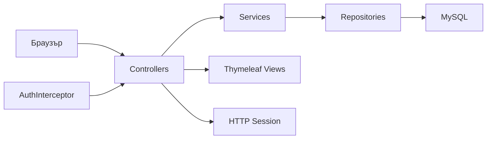

# AS Burgers

  <strong>Уеб приложение за поръчка на бургери</strong> 
  Spring Boot · Thymeleaf · MySQL · Session-based auth

---

## Общ преглед

**AS Burgers** е full-stack monolith за демонстрация на онлайн поръчки: регистрация, преглед на меню, създаване на поръчки, плащане с карта (симулирано) и админ панел за управление на бургери. Интерфейсът е server-rendered (Thymeleaf) с единен визуален стил — <strong>златни и сребърни pill бутони</strong> и <strong>метални форми</strong>.

<table>
  <tr>
    <th>Версия</th>
    <td><code>0.0.1-SNAPSHOT</code></td>
  </tr>
  <tr>
    <th>Java</th>
    <td>21</td>
  </tr>
  <tr>
    <th>Spring Boot</th>
    <td>4.0.6</td>
  </tr>
  <tr>
    <th>Порт по подразбиране</th>
    <td><code>8080</code></td>
  </tr>
  <tr>
    <th>База данни</th>
    <td>MySQL — <code>as_burgers</code></td>
  </tr>
</table>

---

## Технологичен стек

<table>
  <thead>
    <tr>
      <th>Слой</th>
      <th>Технология</th>
      <th>Роля</th>
    </tr>
  </thead>
  <tbody>
    <tr>
      <td>Backend</td>
      <td>Spring Boot Web MVC</td>
      <td>REST/MVC контролери, валидация</td>
    </tr>
    <tr>
      <td>Персистентност</td>
      <td>Spring Data JPA + Hibernate</td>
      <td>Entities, repositories, <code>ddl-auto=update</code></td>
    </tr>
    <tr>
      <td>Изглед</td>
      <td>Thymeleaf</td>
      <td>HTML шаблони + fragments (navbar)</td>
    </tr>
    <tr>
      <td>Стилове</td>
      <td>CSS (<code>static/css/style.css</code>)</td>
      <td>Единен UI: <code>.btn-pill</code>, метални форми</td>
    </tr>
    <tr>
      <td>Сигурност</td>
      <td>BCrypt + HTTP Session</td>
      <td>Хеширани пароли; <code>AuthInterceptor</code> за достъп</td>
    </tr>
    <tr>
      <td>База</td>
      <td>MySQL</td>
      <td>Локална инсталация</td>
    </tr>
    <tr>
      <td>Build</td>
      <td>Maven</td>
      <td><code>mvnw</code> / <code>pom.xml</code></td>
    </tr>
  </tbody>
</table>

---

## Функционалности

### За всички посетители

<ul>
  <li><strong>Начална страница</strong> (<code>/</code>) — фоново изображение, Register / Login</li>
  <li><strong>Регистрация</strong> (<code>/auth/register</code>) — username, email, password, address</li>
  <li><strong>Вход</strong> (<code>/auth/login</code>) — session с <code>userId</code> и <code>role</code></li>
</ul>

### За влезли потребители (USER / ADMIN)

<ul>
  <li><strong>Меню бургери</strong> (<code>/burgers</code>) — карти с снимка, описание, цена, бутон <em>Order</em></li>
  <li><strong>Нова поръчка</strong> (<code>/orders/create</code>) — избор на бургер, количество, адрес за доставка</li>
  <li><strong>Моите поръчки</strong> (<code>/orders/my</code>) — показва поръчка в статус <code>CREATED</code> (чака плащане)</li>
  <li><strong>Плащане</strong> (<code>POST /payments/{orderId}</code>) — holder, номер на карта, CVC (CVC <strong>не се записва</strong>)</li>
  <li><strong>Отказ на поръчка</strong> (<code>POST /orders/{id}/cancel</code>)</li>
  <li><strong>История</strong> (<code>/orders/order-history</code>) — завършени / платени / отменени поръчки (компактен списък)</li>
  <li><strong>Изход</strong> (<code>/auth/logout</code>)</li>
</ul>

### Само за ADMIN

<ul>
  <li><strong>Създаване на бургер</strong> (<code>/burgers/create</code>)</li>
  <li><strong>Редакция</strong> (<code>/burgers/{id}/edit</code>) — UI наличен</li>
  <li><strong>Изтриване</strong> (<code>POST /burgers/{id}/delete</code>)</li>
</ul>

### Статуси на поръчка

  <code>CREATED</code> → <code>PAID</code> → <code>DELIVERING</code> → <code>DELIVERED</code>
  &nbsp;|&nbsp;
  <code>CANCELLED</code>

### Начални данни (Seeder)

При празна база <code>DataSeeder</code> създава:

<table>
  <thead>
    <tr>
      <th>Тип</th>
      <th>Данни</th>
    </tr>
  </thead>
  <tbody>
    <tr>
      <td>Админ</td>
      <td><code>admin</code> / <code>admin123</code> · роля <code>ADMIN</code></td>
    </tr>
    <tr>
      <td>Бургери</td>
      <td>Classic Burger, Bacon Burger, Double Cheese Burger (с Unsplash изображения)</td>
    </tr>
  </tbody>
</table>

---

## Структура на проекта

<pre>
ASBurgers/
├── pom.xml
├── src/main/
│   ├── java/START/
│   │   ├── Application.java
│   │   ├── Config/              # WebMvcConfig, PasswordEncoder
│   │   ├── Enums/               # OrderStatus, PaymentStatus, UserRole
│   │   ├── GlobalExceptionHandler/
│   │   ├── Init/                # DataSeeder, BurgerSchemaMigration
│   │   ├── Models/              # User, Burger, Order, OrderItem, Payment
│   │   ├── Repositories/
│   │   ├── Services/            # User, Burger, Order, Payment
│   │   └── Web/
│   │       ├── Controllers/     # Home, Auth, Burger, Order, Payment
│   │       ├── DTOs/
│   │       └── Interceptor/     # AuthInterceptor
│   └── resources/
│       ├── application.properties
│       ├── static/
│       │   ├── css/style.css
│       │   └── images/          # homePage, burgerPage, loginForm, ...
│       └── templates/
│           ├── index.html
│           ├── login.html, register.html
│           ├── burgers.html, burger-create.html, burger-edit.html
│           ├── order-create.html, my-orders.html, order-history.html
│           ├── error.html
│           └── Fragments/navbar.html
└── README.md
</pre>

---

## Маршрути (обобщение)

<table>
  <thead>
    <tr>
      <th>Метод</th>
      <th>URL</th>
      <th>Описание</th>
      <th>Достъп</th>
    </tr>
  </thead>
  <tbody>
    <tr><td>GET</td><td><code>/</code></td><td>Начало</td><td>Публичен</td></tr>
    <tr><td>GET/POST</td><td><code>/auth/register</code></td><td>Регистрация</td><td>Публичен</td></tr>
    <tr><td>GET/POST</td><td><code>/auth/login</code></td><td>Вход</td><td>Публичен</td></tr>
    <tr><td>GET</td><td><code>/auth/logout</code></td><td>Изход</td><td>Влезъл</td></tr>
    <tr><td>GET</td><td><code>/burgers</code></td><td>Меню</td><td>Влезъл</td></tr>
    <tr><td>GET/POST</td><td><code>/burgers/create</code></td><td>Нов бургер</td><td>ADMIN</td></tr>
    <tr><td>GET</td><td><code>/burgers/{id}/edit</code></td><td>Форма за редакция</td><td>ADMIN</td></tr>
    <tr><td>POST</td><td><code>/burgers/{id}/delete</code></td><td>Изтриване</td><td>ADMIN</td></tr>
    <tr><td>GET/POST</td><td><code>/orders/create</code></td><td>Нова поръчка</td><td>Влезъл</td></tr>
    <tr><td>GET</td><td><code>/orders/my</code></td><td>Плащане / активна поръчка</td><td>Влезъл</td></tr>
    <tr><td>GET</td><td><code>/orders/order-history</code></td><td>История</td><td>Влезъл</td></tr>
    <tr><td>POST</td><td><code>/orders/{id}/cancel</code></td><td>Отказ</td><td>Влезъл</td></tr>
    <tr><td>POST</td><td><code>/payments/{orderId}</code></td><td>Плащане</td><td>Влезъл</td></tr>
  </tbody>
</table>

Статични ресурси: <code>/css/**</code>, <code>/images/**</code> — достъпни без login (конфигурирано в <code>AuthInterceptor</code>).

---

## Домейн модел

<table>
  <thead>
    <tr>
      <th>Entity</th>
      <th>Връзки / бележки</th>
    </tr>
  </thead>
  <tbody>
    <tr>
      <td><code>User</code></td>
      <td>Роли: <code>USER</code>, <code>ADMIN</code> · BCrypt парола</td>
    </tr>
    <tr>
      <td><code>Burger</code></td>
      <td><code>is_available</code> · цена, снимка (URL), съставки</td>
    </tr>
    <tr>
      <td><code>Order</code></td>
      <td>Потребител, адрес, статус, обща сума, <code>OrderItem</code> редове</td>
    </tr>
    <tr>
      <td><code>Payment</code></td>
      <td>Свързано с поръчка · статус на плащане</td>
    </tr>
  </tbody>
</table>

---

## UI / дизайн

<ul>
  <li><strong>Бутони:</strong> <code>.btn-pill</code>, <code>.btn-pill--gold</code>, <code>.btn-pill--silver</code> — еднакви навсякъде</li>
  <li><strong>Форми:</strong> метални панели (<code>.auth-card</code>, <code>.order-payment-card</code>) — злато/сребро рамки, inset полета</li>
  <li><strong>Навигация:</strong> fragment <code>Fragments/navbar.html</code> — pill линкове, активна страница в злато</li>
  <li><strong>Фонове:</strong> отделни изображения per страница (home, burgers, auth, orders)</li>
</ul>

---

## Стартиране локално

<h3>Предварителни изисквания</h3>

<ol>
  <li>JDK <strong>21</strong></li>
  <li>Maven (или <code>./mvnw</code>)</li>
  <li>MySQL сървър на <code>localhost:3306</code></li>
</ol>

<h3>Конфигурация</h3>

Редактирайте <code>src/main/resources/application.properties</code>:

<pre><code>spring.datasource.url=jdbc:mysql://localhost:3306/as_burgers?createDatabaseIfNotExist=true
spring.datasource.username=ВАШИЯ_USER
spring.datasource.password=ВАШАТА_ПАРОЛА
server.port=8080</code></pre>

<blockquote>
  <strong>Препоръка:</strong> Не комитирайте реални пароли в Git. Използвайте environment variables или <code>application-local.properties</code> (в <code>.gitignore</code>).
</blockquote>

<h3>Старт</h3>

<pre><code># Windows
mvnw.cmd spring-boot:run

# Linux / macOS
https://github.com/AStoyan0ff/ASBurgers.git

Отворете: <a href="http://localhost:8080">http://localhost:8080</a>

---

## Архитектура (накратко)

Слоевете следват класическия Spring MVC pattern: Controller → Service → Repository. Авторизацията е custom (interceptor + session), не Spring Security filter chain.

---

## Бъдещи подобрения

Планирани и препоръчани стъпки за следващи итерации:

<h3>Висок приоритет</h3>

<ul>
  <li><strong>Spring Security (пълноценно)</strong> — замяна или допълване на <code>AuthInterceptor</code> с role-based URL rules, CSRF защита</li>
  <li><strong>Тайни извън репото</strong> — <code>SPRING_DATASOURCE_*</code> env vars, профили <code>dev</code> / <code>prod</code></li>
  <li><strong>Интеграционни тестове</strong> — MockMvc за auth, orders, admin flows</li>
</ul>

<h3>Функционалност</h3>

<ul>
  <li>Количка с множество артикули преди checkout</li>
  <li>Реален payment gateway (Stripe и др.) вместо симулирано плащане</li>
  <li>Проследяване на доставка — автоматична смяна <code>DELIVERING</code> → <code>DELIVERED</code></li>
  <li>Email потвърждения при регистрация и поръчка</li>
  <li>Качване на снимки за бургери (не само URL)</li>
  <li>Профил на потребител — редакция на адрес и парола</li>
  <li>Търсене и филтри в менюто (цена, съставки)</li>
</ul>

<h3>UI / UX</h3>

<ul>
  <li>Responsive подобрения за мобилни устройства</li>
  <li>Единна дизайн система (CSS variables / optional component library)</li>
  <li>Метален стил и за картите в <code>/orders/order-history</code> (в момента са по-стар зелен акцент)</li>
  <li>i18n — български/английски превключване</li>
  <li>Accessibility (ARIA, контраст, keyboard navigation)</li>
</ul>

<h3>Техническо качество</h3>

<ul>
  <li>DTO ↔ Entity мапване с MapStruct</li>
  <li>Пагинация за история и админ списъци</li>
  <li>OpenAPI документация, ако се добави REST API</li>
  <li>Docker Compose (<code>app</code> + <code>mysql</code>) за еднокоманден старт</li>
  <li>CI pipeline (GitHub Actions) — build + tests</li>
  <li>Логиране и мониторинг (Actuator, structured logs)</li>
</ul>

<h3>Сигурност</h3>

<ul>
  <li>Rate limiting на login/register</li>
  <li>Валидация на карта с Luhn algorithm (вече частично на front-end)</li>
  <li>Audit log за admin действия</li>
  <li>HTTPS зад reverse proxy в production</li>
</ul>

---

## Лиценз и автор

Created by AStoyanoff® 2026

